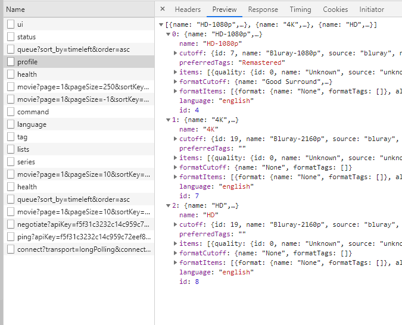

# Syncarr
Syncs two Radarr/Sonarr/Lidarr servers through the web API.

### Configuration
 1. Edit the config.conf file and enter your servers URLs and API keys for each server.  
 2. Add the profile id and movie path for the radarr instance the movies will be synced to
    ```ini
    [radarrA]
    url = https://example.com:443
    key = XXXXX
    
    [radarrB]
    url = http://127.0.0.1:8080
    key = XXXXX
    profile_id = 1
    path = /data/4k_Movies
    ```
 3. Or if you want to sync two sonarr instances:
    ```ini
    [sonarrA]
    url = https://example.com:443
    key = XXXXX
    
    [sonarrB]
    url = http://127.0.0.1:8080
    key = XXXXX
    profile_id = 1
    path = /data/4k_Shows
 
 4. Or if you want to sync two lidarr instances:
    ```ini
    [lidarrA]
    url = https://example.com:443
    key = FCKGW-RHQQ2-YXRKT-8TG6W-2B7Q8
    
    [lidarrB]
    url = http://127.0.0.1:8080
    key = FCKGW-RHQQ2-YXRKT-8TG6W-2B7Q8
    profile_id = 1
    path = /data/lossless_music
    ```

    **Note**: you cannot have a mix of radarr, lidarr, or sonarr config setups at the same time.

 5. By default Syncarr will sync unidirectionally from instance A to instance B but you can add bidirectional syncing with:
     ```ini
     [general]
     sync_bidirectionally = 1
     ```

To get the `profile_id`, open developer tools (f12) in the browser and go to network tab and reload your *arr instance. There will be a profile network call and under the preview tab, you'll see a list of your profiles you have setup. In my example, I only have three profiles (HD-1080p, 4K, and HD). You need the `id` of what you want your instance B movies to be. Example: If you are syncing 4k radarr to 1080p radarr then get you 1080p profile id from the 1080p radarr instance (1080p is instance B in this example - sync FROM A TO B)



#### How to Run
You can run this script directly or through a Cron:
```bash
python index.py
```

#### Docker Compose
This script can run through a docker container with a set interval (default every 5 minutes)

```
syncarr:
    image: syncarr/syncarr:latest
    container_name: syncarr
    restart: unless-stopped
    environment:
        RADARR_A_URL: https://example.com:443
        RADARR_A_KEY: XXXXX
        RADARR_B_URL: http://127.0.0.1:8080
        RADARR_B_KEY: XXXXX
        RADARR_B_PROFILE_ID: 1
        RADARR_B_PATH: /data/4k_Movies
        SYNC_INTERVAL_SECONDS: 300
```

or

```
syncarr:
    image: syncarr/syncarr:latest
    container_name: syncarr
    restart: unless-stopped
    environment:
        SONARR_A_URL: https://example.com:443
        SONARR_A_KEY: XXXXX
        SONARR_B_URL: http://127.0.0.1:8080
        SONARR_B_KEY: XXXXX
        SONARR_B_PROFILE_ID: 1
        SONARR_B_PATH: /data/4k_Movies
        SYNC_INTERVAL_SECONDS: 300
```

or

```
syncarr:
    image: syncarr/syncarr:latest
    container_name: syncarr
    restart: unless-stopped
    environment:
        LIDARR_A_URL: https://example.com:443
        LIDARR_A_KEY: FCKGW-RHQQ2-YXRKT-8TG6W-2B7Q8
        LIDARR_B_URL: http://127.0.0.1:8080
        LIDARR_B_KEY: FCKGW-RHQQ2-YXRKT-8TG6W-2B7Q8
        LIDARR_B_PROFILE_ID: 1
        LIDARR_B_PATH: /data/4k_Movies
        SYNC_INTERVAL_SECONDS: 300
```

#### Docker
For just plain docker:

```
docker run -it --rm --name syncarr -e RADARR_A_URL=https://example.com:443 -e RADARR_A_KEY=XXXXX -e RADARR_B_URL=http://127.0.0.1:8080 -e RADARR_B_KEY=XXXXX -e RADARR_B_PROFILE_ID=1 -e RADARR_B_PATH=/data/4k_Movies -e SYNC_INTERVAL_SECONDS=300 syncarr/syncarr
```

#### Requirements
 * Python 3.4 or greater
 * 2x Radarr/Sonarr/Lidarr servers
 * Install requirements.txt

#### Debugging
If you need to debug syncarr then you can either set the log level through the config file:

```ini
[general]
log_level = 10
```
    
Or in docker, set the `LOG_LEVEL` ENV var. Default is set to `20` (info only) but you can set to `10` to get debug info as well. When pasting debug logs online, **make sure to remove any apikeys and any other data you don't want others to see.**


#### Disclaimer
Back up your instances before trying this out. I am not responsible for any lost data.
